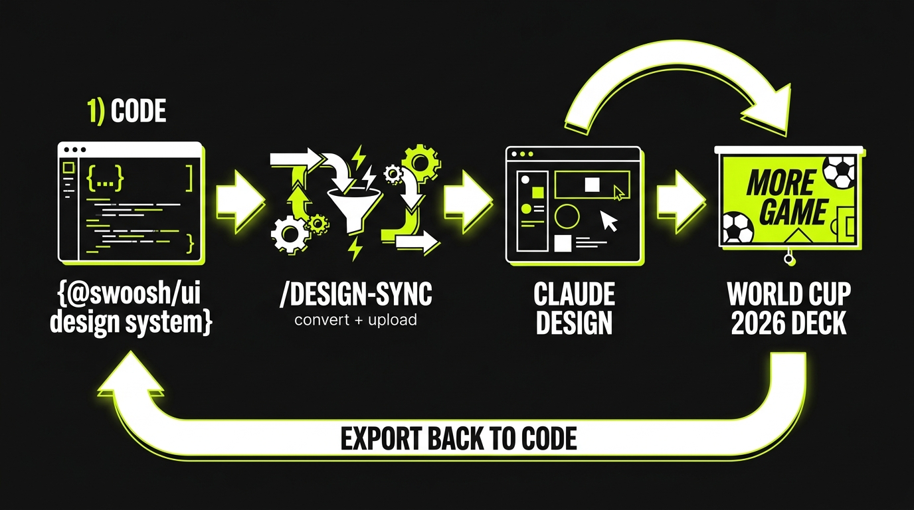
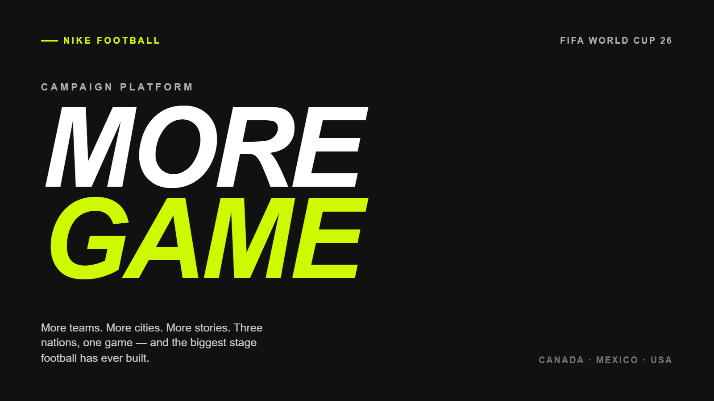
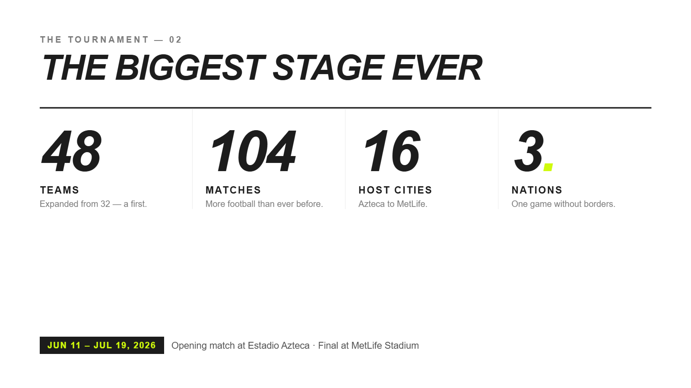
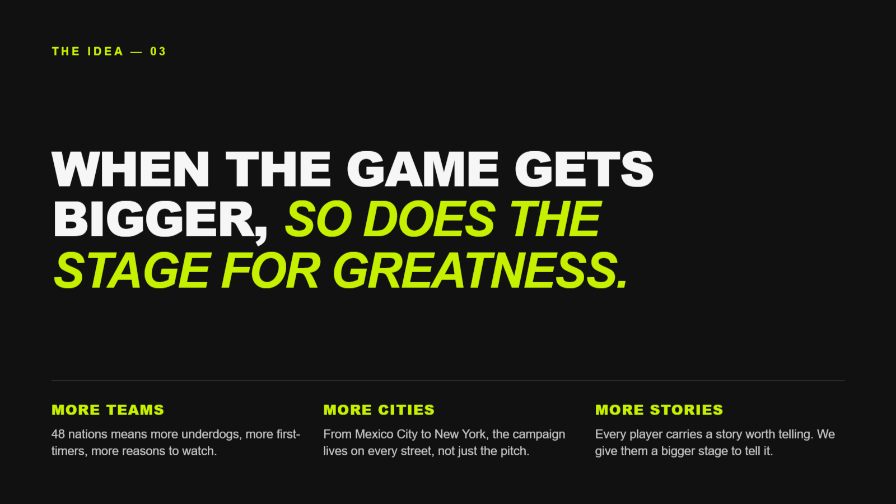
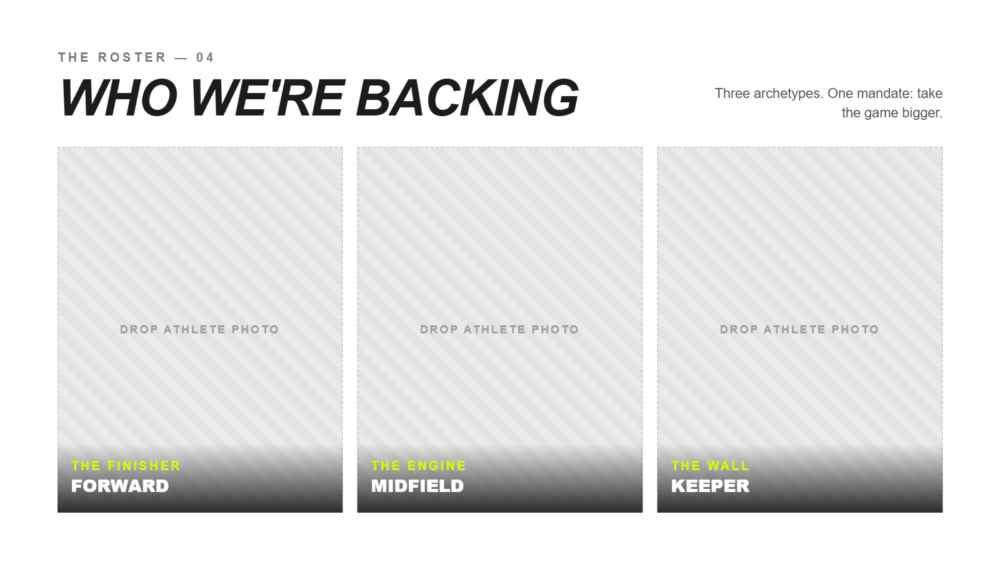

# Claude Design Sync — Nike DS → World Cup 2026 Deck



A full **round-trip** through Claude's design tooling: build a design system **as
code**, push it into **Claude Design** with `/design-sync`, use it to design a
5‑slide campaign deck in the browser, then **export that deck back to code** as a
self‑contained, runnable web page.

> **Inspiration:** [*Claude Design just got MASSIVE Upgrades (2.0 Update)*](https://www.youtube.com/watch?v=JYZ7i1NFiyM) — this project recreates and documents that workflow end‑to‑end.

---

## ▶ Live demo

GitHub can't run JavaScript inside a README, so the deck is hosted on **GitHub Pages**.
**Click the cover to open the live, keyboard‑navigable deck:**

[](https://az9713.github.io/claude-design-sync/)

🔗 **Live deck:** https://az9713.github.io/claude-design-sync/
*(← / → / Space to navigate · `P` to print to PDF)*

| | | |
|:--:|:--:|:--:|
|  |  |  |
| **48 / 104 / 16 / 3** | **The Idea** | **Who we're backing** |

---

## The round‑trip

```
  CODE            ──/design-sync──▶   CLAUDE DESIGN     ──design agent──▶   A DECK          ──get_file + reimplement──▶   RUNNABLE CODE
  @swoosh/ui repo                     Nike DS project                       .dc.html                                      index.html
  14 components     convert + upload  builds WITH your   designs with       MORE GAME         export back                 self-contained
                                      real components    your components                                                  no dependencies
```

1. **Build** a Nike‑inspired component library as code (tokens + 14 React components → `dist/`).
2. **Sync** it into Claude Design with `/design-sync` — it compiles the repo into an importable bundle, generates an API contract + preview card + usage doc per component, render‑checks every card, and uploads it.
3. **Design** a Nike *"MORE GAME"* World Cup 2026 deck in Claude Design, built on those real components.
4. **Export** the deck back out via the `DesignSync` file API and re‑implement it as a portable, dependency‑free HTML deck.

A full behind‑the‑scenes walkthrough — including how `/design-sync` works under the
hood and how the export back to code happens — is in **[DESIGN-SYNC-JOURNEY.md](DESIGN-SYNC-JOURNEY.md)**.

---

## What's inside

| Path | What it is |
|---|---|
| [`nike-design-system/`](nike-design-system/) | **Swoosh UI** (`@swoosh/ui`) — Nike‑inspired design system: `--swoosh-*` tokens + 14 typed React components, esbuild build → `dist/`. The input to `/design-sync`. |
| [`world-cup-2026-deck/`](world-cup-2026-deck/) | The exported deck as a **single self‑contained `index.html`** (5 slides, vanilla slide engine, no dependencies) + slide screenshots. |
| [`DESIGN-SYNC-JOURNEY.md`](DESIGN-SYNC-JOURNEY.md) | The detailed, behind‑the‑scenes development journey. |

---

## Quick start

**Run the deck locally:**
```bash
# just open it — no build, no dependencies
open world-cup-2026-deck/index.html        # or double-click it
```

**Build the design system:**
```bash
cd nike-design-system
npm install
npm run build      # → dist/index.js (window.SwooshUi) + dist/index.css + .d.ts
```

---

## How the three mechanisms work (short version)

- **Creating a Claude Design System** = writing a normal component library that builds
  to a `dist/`. Tokens carry the look; `.d.ts` carries the API. Code is the source of truth.
- **`/design-sync`** = a deterministic *converter + verifier + uploader*. It wraps your
  compiled `dist/` into a `window.<Global>` bundle, derives a preview card + API + usage
  doc per component, render‑checks each in headless Chromium, writes a content‑hash
  *anchor* for fast re‑syncs, and uploads. Then you **publish** to make it selectable.
- **Export back to code** = reading the design's `.dc.html` source via the `DesignSync`
  file API and re‑hosting it — here, stripping the Claude Design runtime and keeping the
  markup so it runs anywhere.

---

## Disclaimer

**"Swoosh UI" is an unofficial mock**, not affiliated with, endorsed by, or produced by
Nike, Inc. It borrows Nike's public visual language (black/white, volt‑green accent, bold
type) purely for demonstration. The World Cup 2026 deck is a fictional campaign concept.
